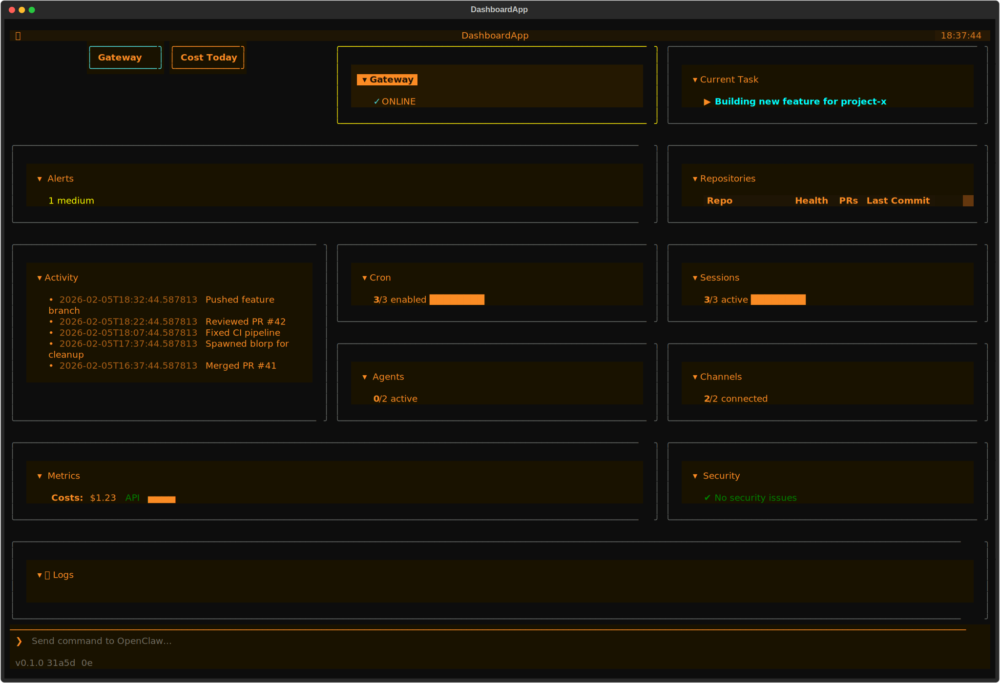

# openclaw-dash


[](LICENSE)
[](https://www.python.org/)
[](https://github.com/dlorp/openclaw-dash/actions)
[](https://github.com/dlorp/openclaw-dash)

TUI dashboard for monitoring and managing your [OpenClaw](https://github.com/openclaw/openclaw) ecosystem.


<details>
<summary>Phosphor Theme (amber CRT aesthetic)</summary>



</details>

<details>
<summary>ASCII Preview</summary>

```
+-----------------------------------------------------------------------------+
|  OPENCLAW DASHBOARD                                      14:32 PST          |
|  Gateway: ONLINE    $0.42/day    0.2% ctx    12 day streak                  |
+-----------------------------------------------------------------------------+
| GATEWAY              | CURRENT TASK                                        |
|   * ONLINE           |   Building new feature for project-x                |
|   ctx: ==--  24%     |   > Implementing auth module                        |
|   2h uptime          |   > Writing tests                                   |
+----------------------+-----------------------------------------------------+
| REPOS                          | ACTIVITY                                   |
|   my-project      *   0 PRs    |   > 14:30 Pushed feature branch            |
|   another-repo    o   2 PRs    |   > 14:00 Reviewed PR #42                  |
|   side-project    o   5 PRs    |   > 13:30 Fixed CI pipeline                |
+--------------------------------+--------------------------------------------+
| SESSIONS                                                                    |
|   * main         [========--] 45%                                           |
|   o sub-agent-1  [=-------] 12%                                             |
|   o sub-agent-2  [--------]  8%                                             |
+-----------------------------------------------------------------------------+
| [h] Help  [f] Jump  [t] Theme  [s] Settings  [Ctrl+P] Palette       [q] Quit|
+-----------------------------------------------------------------------------+
```

</details>

## Features

### Dashboard Panels

| Panel | Description |
|-------|-------------|
| **Gateway Status** | Health indicator, context usage, uptime, connection state |
| **Metric Boxes** | KPI bar: gateway status, daily cost, error rate, streak |
| **Current Task** | What your agent is actively working on |
| **Repository Health** | PR counts, CI status, TODO metrics per repo |
| **Activity Log** | Timestamped action history |
| **Sessions** | Active sessions with context burn rate visualization |
| **Agents** | Sub-agent roster with status, context, and task summaries |
| **Cron Jobs** | Scheduled tasks, next run times, status |
| **Alerts** | Color-coded severity alerts aggregated from all sources |
| **Channels** | Connected messaging channels (Discord, Telegram, etc.) |
| **Security Audit** | Config issues, dependency vulnerabilities, dangerous patterns |
| **Metrics** | Cost tracking, performance stats, GitHub contribution streak |
| **System Resources** | CPU, memory, disk, network I/O (toggle with `x`) |
| **Logs** | Real-time gateway log viewer with filtering |
| **Model Manager** | View and configure available LLM models by tier |

### UI Features

- **Settings Screen** — Modal configuration UI (`s`) with tabbed sections: General, Tools, Appearance, Keybinds, Models
- **Collapsible Panels** — Collapse/expand any panel with `Enter`, or all with `Ctrl+[`/`Ctrl+]`
- **Jump Mode** — Press `f` to show letter labels, then press a letter to focus that panel
- **Command Palette** — `Ctrl+P` for quick access to all commands
- **Vim Navigation** — `j`/`k` scroll, `G` end, `Home` top
- **Themes** — Dark, light, and phosphor (amber CRT aesthetic) — cycle with `t`
- **Notifications** — Toast notifications for important events
- **Responsive Layout** — Adapts to terminal size, prioritizes critical panels
- **Demo Mode** — `--demo` flag for showcasing without a live gateway

### Services

- **Gateway Client** — Async communication with OpenClaw gateway API
- **Model Discovery** — Discovers available models from gateway, organized by tier (Fast/Balanced/Powerful)

## Keyboard Shortcuts

### Global Actions

| Key | Action |
|-----|--------|
| `q` | Quit application |
| `r` | Refresh all panels |
| `t` | Cycle theme (dark/light/phosphor) |
| `h` / `?` | Show help panel |
| `s` | Open settings screen |
| `Ctrl+P` | Open command palette |

### Navigation

| Key | Action |
|-----|--------|
| `Tab` / `Shift+Tab` | Navigate to next/previous panel |
| `f` / `/` | Enter jump mode (show panel labels) |
| `j` / `k` | Scroll down/up (Vim-style) |
| `G` | Jump to end of panel |
| `Home` | Jump to top of panel |

### Panel Focus Shortcuts

| Key | Panel |
|-----|-------|
| `g` | Gateway |
| `m` | Metrics |
| `a` | Alerts |
| `c` | Cron |
| `p` | Repos |
| `l` | Logs |
| `n` | Agents |

### Panel Management

| Key | Action |
|-----|--------|
| `Enter` | Toggle focused panel collapse/expand |
| `Ctrl+[` | Collapse all panels |
| `Ctrl+]` | Expand all panels |
| `x` | Toggle resources panel visibility |

### Tab Groups

| Key | Action |
|-----|--------|
| `1` | Focus Runtime tab group (Sessions/Agents/Cron/Channels) |
| `2` | Focus Code tab group (Repos/Activity) |
| `[` | Previous tab in focused group |
| `]` | Next tab in focused group |

### Input

| Key | Action |
|-----|--------|
| `:` / `i` | Focus command input pane |

## Installation

**Note**: This package is not yet published to PyPI. Install from source:

```bash
git clone https://github.com/dlorp/openclaw-dash.git
cd openclaw-dash
pip install -e .
```

For development with additional tools:

```bash
pip install -e ".[dev]"
```

## CLI Usage

### Dashboard

```bash
openclaw-dash              # Launch TUI dashboard
openclaw-dash --demo       # Demo mode (no gateway required)
openclaw-dash --status     # Quick text status
openclaw-dash --json       # JSON output for scripting
openclaw-dash --skip-gateway  # Skip gateway connection
```

### Security

```bash
openclaw-dash security              # Run security audit
openclaw-dash security --deep       # Full vulnerability scan (slower)
openclaw-dash security --fix        # Auto-fix safe issues
openclaw-dash security --json       # JSON output
```

### Automation

```bash
openclaw-dash auto merge            # Auto-merge approved PRs
openclaw-dash auto merge --dry-run  # Preview without merging
openclaw-dash auto cleanup          # Clean stale branches
openclaw-dash auto deps             # Update dependencies
openclaw-dash auto deps --security  # Security updates only
openclaw-dash auto backup           # Backup workspace state
```

### Diagnostics

```bash
openclaw-dash collectors            # Test all data collectors
openclaw-dash models                # List available models
openclaw-dash models --json         # JSON model inventory
openclaw-dash metrics               # View metrics dashboard
```

## Integrated Tools

Bundled CLI tools for repository management:

| Tool | Command | Description |
|------|---------|-------------|
| **repo-scanner** | `python -m openclaw_dash.tools.repo-scanner` | Repository health metrics (TODOs, tests, PRs) |
| **pr-tracker** | `python -m openclaw_dash.tools.pr-tracker` | PR status monitoring, merge detection |
| **smart-todo-scanner** | `python -m openclaw_dash.tools.smart-todo-scanner` | Context-aware TODO categorization |
| **dep-shepherd** | `python -m openclaw_dash.tools.dep-shepherd` | Dependency auditing and updates |
| **pr-describe** | `python -m openclaw_dash.tools.pr-describe` | Auto-generate PR descriptions |
| **pr-create** | `python -m openclaw_dash.tools.pr-create` | Streamlined PR creation |
| **audit** | `python -m openclaw_dash.tools.audit` | Security scanning |
| **version-bump** | `python -m openclaw_dash.tools.version-bump` | Semantic versioning from commits |
| **changelog** | `python -m openclaw_dash.tools.changelog` | Generate changelogs |

See [Tools Reference](docs/TOOLS.md) for detailed usage.

## Automation Features

### Auto-Merge (`auto merge`)

Automatically merges PRs that meet criteria:
- CI passing (configurable)
- Required approvals met
- Branch matches safelist patterns (deps/, dependabot/, renovate/)
- Deletes branch after merge (configurable)

### Stale Branch Cleanup (`auto cleanup`)

Removes old merged branches:
- Configurable age threshold (default: 30 days)
- Protects main, master, develop, release/* patterns
- Dry-run mode for preview

### Dependency Updates (`auto deps`)

Automated dependency management:
- Scans configured repos for outdated packages
- Creates PRs for updates
- Security-only mode available
- Rate-limited to prevent PR spam

## Configuration

Config file: `~/.config/openclaw-dash/config.toml`

```toml
# Display
theme = "phosphor"          # dark, light, or phosphor
refresh_interval = 30       # seconds between auto-refresh
show_resources = true       # show system resources panel
show_notifications = true   # desktop notifications

# Connection
gateway_host = "localhost"
gateway_port = 18789

# Paths
repos_path = "~/repos"
workspace_path = "~/.openclaw/workspace"

# Panels
collapsed_panels = []       # panels to start collapsed

# Automation
[automation]
safelist = ["deps/", "dependabot/", "renovate/"]
require_ci = true
require_approval = true
min_approvals = 1
```

## Architecture

```
openclaw-dash/
  src/openclaw_dash/
    app.py              # Main Textual application
    cli.py              # CLI entry point and commands
    collectors/         # Data collection from various sources
      gateway.py        # OpenClaw gateway status
      sessions.py       # Session information
      repos.py          # Repository health
      alerts.py         # Alert aggregation
      ...
    widgets/            # TUI panel components
      gateway_status.py
      sessions_panel.py
      alerts.py
      ...
    screens/            # Modal screens
      settings_screen.py
    services/           # Backend services
      gateway_client.py # Gateway API communication
      model_discovery.py
    security/           # Security scanning
      audit.py
      deps.py
      fixes.py
    automation/         # Automation features
      pr_auto.py        # PR merge/cleanup
      deps_auto.py      # Dependency updates
      backup.py         # Workspace backup
    tools/              # Standalone CLI tools
      repo-scanner.py
      pr-tracker.py
      ...
    metrics/            # Metrics collection
      costs.py
      github.py
      performance.py
```

## Requirements

- Python 3.10+
- [OpenClaw](https://github.com/openclaw/openclaw) gateway (for live data)
- `gh` CLI (for GitHub integration)

## Documentation

| Document | Description |
|----------|-------------|
| [Installation Guide](docs/INSTALLATION.md) | Detailed setup instructions |
| [Configuration](docs/CONFIGURATION.md) | All config options explained |
| [Widgets Reference](docs/WIDGETS.md) | Panel documentation |
| [Tools Reference](docs/TOOLS.md) | CLI tools usage |
| [Development Guide](docs/DEVELOPMENT.md) | Contributing, testing, adding widgets |
| [Architecture](docs/ARCHITECTURE.md) | System design overview |

## Contributing

See [CONTRIBUTING.md](CONTRIBUTING.md) for guidelines.

## License

[PolyForm NonCommercial 1.0.0](LICENSE) — free for personal and non-commercial use
