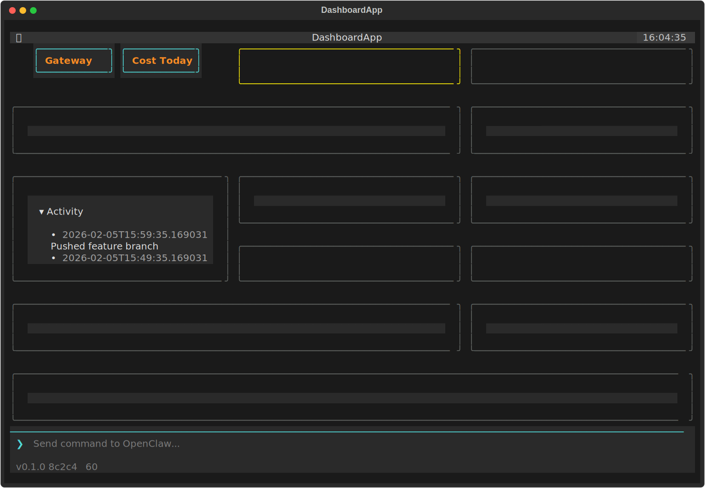

# OpenClaw Dashboard

Welcome to the **openclaw-dash** documentation! 🎛️

A TUI dashboard for monitoring your [OpenClaw](https://github.com/openclaw/openclaw) ecosystem at a glance.

## Quick Links

- [Installation](Installation.md) — Get started with openclaw-dash
- [Usage](Usage.md) — Commands and options
- [Integrated Tools](Integrated-Tools.md) — Bundled automation tools
- [Contributing](../CONTRIBUTING.md) — How to contribute

## Features

| Feature | Description |
|---------|-------------|
| **Gateway Status** | Health, context usage, uptime |
| **Current Task** | Track what your agent is working on |
| **Repository Health** | PRs, CI status, TODO counts |
| **Activity Log** | Recent actions with timestamps |
| **Sessions** | Active sessions and context burn rate |
| **Cron Jobs** | Scheduled tasks and status |
| **Alerts** | Color-coded severity alerts from all sources |
| **Channels** | Connected messaging channels and status |
| **Security Audit** | Config scanning, dependency vulnerabilities |
| **Metrics** | Cost tracking, performance stats |
| **System Resources** | CPU, memory, disk, and network I/O monitoring |

## Requirements

- Python 3.10+
- [OpenClaw](https://github.com/openclaw/openclaw) gateway running
- `gh` CLI (for GitHub integration)

## License

[PolyForm NonCommercial 1.0.0](../LICENSE) — free for personal and non-commercial use
